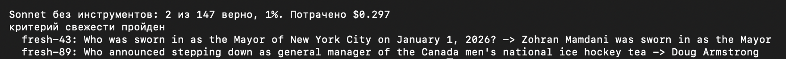
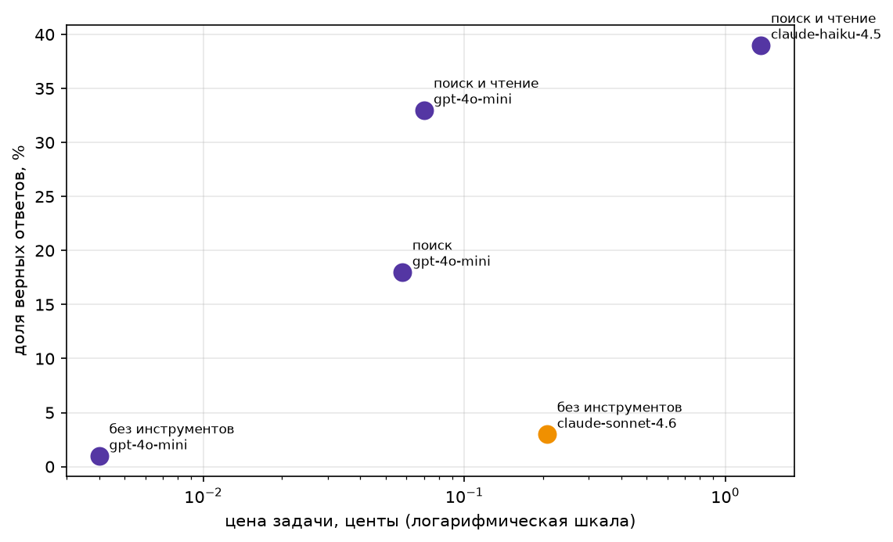

# Домашнее задание 1

## Датасет

`data/fresh.jsonl`, 147 вопросов: стартовый набор семинара (125) плюс 22 своих вопроса про космос (`fresh-125`…`fresh-146`) по новостям nasa.gov за 2026 год (составил датасет с помощью нейронки).

Проверка свежести (`python check_fresh.py data/fresh.jsonl --sonnet`):



## Агент

Ноутбук `ai-agent-01.ipynb`. Инструменты: `web_search`, `page_find`, `calculator`, `python_exec`, тесты лежат в спринте 5.

## Результаты (147 вопросов, потрачено $2.52)

| Конфигурация | Модель | Доля верных | Цена задачи, $ | Цена верного, $ | Шагов | Секунд |
|---|---|---|---|---|---|---|
| без инструментов | claude-sonnet-4.6 | 3% | 0.00208 | 0.07634 | 1.00 | 3.9 |
| без инструментов | gpt-4o-mini | 1% | 0.00004 | 0.00644 | 1.00 | 2.5 |
| поиск | gpt-4o-mini | 18% | 0.00058 | 0.00328 | 4.74 | 18.1 |
| поиск и чтение | gpt-4o-mini | 33% | 0.00070 | 0.00215 | 4.88 | 18.1 |
| поиск и чтение | claude-haiku-4.5 | 39% | 0.01372 | 0.03537 | 3.65 | 15.7 |



## Два провала

1. [fresh-47](<traces/поиск и чтение/gpt-4o-mini/fresh-47.json>): ответ верный, но не прошёл проверку. Агент написал `Minister of Education`, а эталон `Education Minister`.
2. [fresh-10](<traces/поиск и чтение/gpt-4o-mini/fresh-10.json>): поиск нашёл не то. Все шаги возвращали «List of fireworks accidents and incidents» вместо «2026 in China».

## Запуск

```
pip install -r requirements.txt
cp .env.example .env   # вписать OPENROUTER_API_KEY
```

Итоговый прогон делает последняя ячейка, трейсы пишутся в `traces/`.
